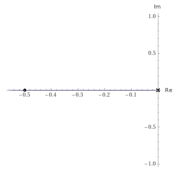

# Drone Facial Recognition

This code is to get started with the application of computer vision for the Tello drone.  It contains:

 * `findFace`
    * Function to detect forwards facing person using the Haar feature-based cascade classifier.
 * `trackFace`
    * Function which allows for input from the camera and accurate face tracking via PI control scheme.

## Overview

The implementation **must** meet the following requirements:

 * There is a class called `findFace` .
    * Using the facial detection algorithm it should be able to single out the person closest to camera and draw a rectangle around the detected face.
    * Calculates the midpoint of the face and draws a dot at the centered point.
 * The `trackFace` allows for active and accurate face tracking as point of focus is moving.
    * Uses PI control to accurately track the user's face and make adjustments to the drone as needed.
    * For the control scheme it needs to update fast while having little to no error and overshoot. As a result the values chosen are **0.8** and **0.5** respectively for the proportional and integral component of the controller.
    * Below is the Root Locus diagram of the implemented PI control scheme for the drone. 
    * 
 
 * **Functional Demo**
   
